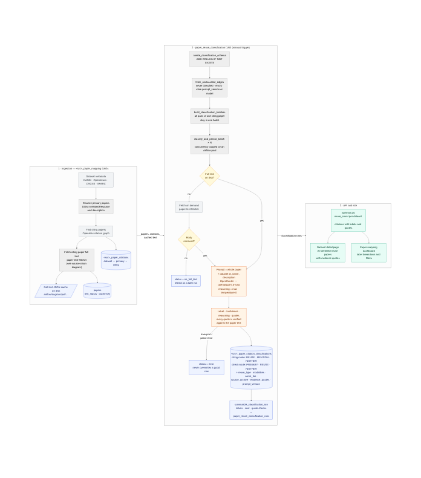
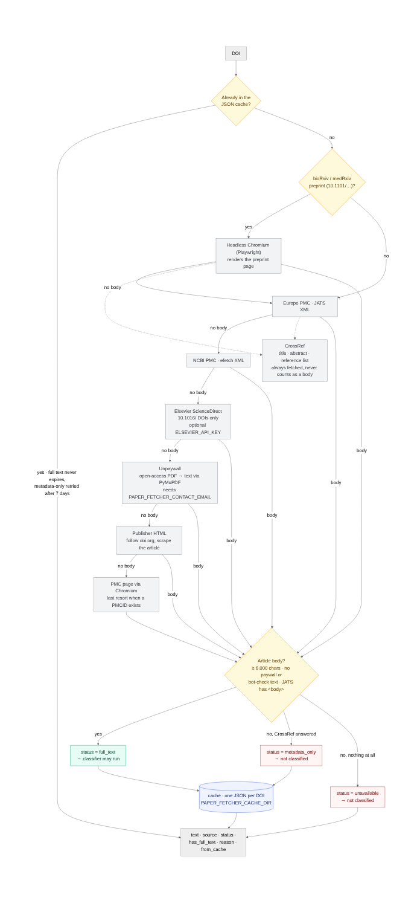

# NeuroD3: Neuroscience Dataset Discovery and Citation Platform

A comprehensive platform for discovering, tracking, and analyzing neuroscience datasets across multiple repositories. This project helps researchers find datasets, track citations, and understand data sharing patterns in neuroscience research.

## Our Goals

Develop tools to:

- **Bright Data**: Help the neuroscience community find datasets across repositories and identify the most cited and used datasets
- **Dark Data**: Determine which neuroscience papers share and reuse data, and estimate data sharing rates across modalities, journals, and funders
- **Incentivize Sharing**: Incentivize researchers to share data by showcasing citations and use of shared data

## Our Approach

- **Data Pipeline**: Develop a pipeline that regularly scrapes datasets and papers, and identifies which datasets are associated with each paper, both for sharing and reuse
- **Bright Data Dashboard**: Create a bright data dashboard that aggregates datasets across repositories and links to papers that cite each dataset
- **Queryable Database**: Create a queryable database of papers, their shared datasets, and used datasets. We may also build a dark data dashboard with summary plots

## What We've Accomplished

- ✅ Built an initial frontend and backend for a bright data dashboard
- ✅ Created an Airflow pipeline that automates ingestion of dataset metadata from DANDI
- ✅ Evaluated Data Citation Corpus and OpenAlex for collecting citations - both index many citations but are not complete and lack full text for distinguishing primary from secondary usage

## Next Steps

- Connect frontend filters to backend and add pagination
- Set up CI/CD pipelines and find a hosting platform
- Create ingestion pipelines for OpenNeuro and other data sources
- Research paper fulltext sources, such as the PubMed Central Open Access Subset, and ODDPub's NLP approach to finding data citations
- Set up paper ingestion pipeline with LLM-based citation identification

---

## Prerequisites

- Docker Desktop (or Docker Engine + Docker Compose)
- At least 4GB of RAM available for Docker
- At least 10GB of free disk space

---

## Getting Started

### First Time Setup

1. **Set the Airflow user ID** (Linux/Mac only):
   ```bash
   echo -e "AIRFLOW_UID=$(id -u)" > .env
   ```
   
   On Windows, the `.env` file is already configured with `AIRFLOW_UID=50000`.

2. **Initialize Airflow** (first time only):
   ```bash
   docker compose up airflow-init
   ```

### Spinning Up the Project

To start all services:

```bash
docker compose up -d --build --force-recreate
```

This command will:
- Build all Docker images from scratch (`--build`)
- Recreate all containers even if they already exist (`--force-recreate`)
- Run all services in detached mode (`-d`)

### Tearing Down the Project

To stop all services:

```bash
docker compose down
```

To stop all services **and remove all volumes** (including database data):

```bash
docker compose down -v
```

⚠️ **Warning**: The `-v` flag will delete all database data. Use this when you want a completely fresh start.

#### PR preview teardown (project-scoped)

If you started a PR preview stack with a project name (example: `pr-45`) using `docker-compose.pr.yml`, you must pass the same `-p` and `-f` flags when tearing it down:

```bash
docker compose -p pr-45 -f docker-compose.pr.yml down -v
```

#### Verifying the Postgres version

After bringing the stack up, you can confirm the running Postgres version with:

```bash
docker compose exec -T postgres psql -U airflow -d airflow -c "SELECT version();"
```

For a PR preview stack (example: `pr-45`):

```bash
docker compose -p pr-45 -f docker-compose.pr.yml exec -T postgres psql -U airflow -d airflow -c "SELECT version();"
```

---

## Localhost Locations and Ports

Once the project is running, access the following services:

| Service | URL | Credentials |
|---------|-----|-------------|
| **Frontend Dashboard** | http://localhost:3000 | N/A |
| **API Backend** | http://localhost:8000 | N/A |
| **API Documentation (Swagger)** | http://localhost:8000/docs | N/A |
| **API Documentation (ReDoc)** | http://localhost:8000/redoc | N/A |
| **Airflow Web UI** | http://localhost:8080 | Username: `airflow`<br>Password: `airflow` |
| **pgAdmin (Database Management)** | http://localhost:5050 | Email: `admin@admin.com`<br>Password: `admin` |
| **PostgreSQL Database** | localhost:5432 | Username: `airflow`<br>Password: `airflow` |

### Database Servers in pgAdmin

When you first access pgAdmin, you should see two pre-configured database servers:
- **Local PostgreSQL - Airflow** (airflow database) - Stores Airflow metadata
- **Local PostgreSQL - DAG Data** (dag_data database) - Stores neuroscience datasets

**First time connecting to a server:**
- Click on a server name
- Enter the password: `airflow`
- Check "Save password" to avoid entering it again

If servers don't appear, try refreshing the browser (Ctrl+Shift+R or Cmd+Shift+R).

---

## Project Structure

```
.
├── api/                      # FastAPI backend service
│   ├── Dockerfile
│   ├── main.py              # Main API application
│   └── requirements.txt     # Python dependencies
│
├── frontend/                 # React + TypeScript frontend
│   ├── src/
│   │   ├── App.tsx          # Main React component
│   │   ├── components/      # React components
│   │   ├── services/        # API service layer
│   │   └── types/           # TypeScript type definitions
│   ├── public/              # Static files
│   ├── Dockerfile
│   └── package.json         # Node.js dependencies
│
├── airflow/                 # Apache Airflow image + DAGs/config/plugins
│   ├── Dockerfile           # Custom Airflow image with dependencies
│   ├── requirements.txt     # Python package dependencies (Airflow)
│   ├── dags/                # Apache Airflow DAGs
│   │   ├── dandi_ingestion.py        # DAG for ingesting DANDI datasets
│   │   ├── populate_datasets_dag.py  # DAG for populating datasets from multiple sources
│   │   ├── database_example_dag.py   # Example DAG demonstrating database operations
│   │   ├── example_dag.py            # Basic Airflow example
│   │   └── utils/           # Shared utilities for DAGs
│   │       ├── database.py            # Database connection and query utilities
│   │       └── environment.py        # Environment detection utilities
│   ├── config/              # Airflow configuration files
│   │   └── airflow.cfg
│   ├── plugins/             # Custom Airflow plugins
│   └── logs/                # Airflow logs (auto-created)
│
├── database/                # Database initialization scripts
│   ├── init-db.sql          # Initial database schema setup
│   └── pgadmin-servers.json # pgAdmin server configuration
│
├── docs/                    # Documentation
│   ├── API_USAGE.md         # API usage guide
│   ├── DATABASE_SETUP.md    # Database setup details
│   └── data_citation_notes.md
│
├── docker-compose.yml       # Docker Compose configuration
└── README.md                # This file
```

---

## Database and Views

The project uses PostgreSQL with two databases:

### Databases

1. **`airflow`** - Stores Airflow metadata (DAG runs, task instances, etc.)
2. **`dag_data`** - Stores neuroscience datasets and related data

### Tables

#### 1. `dandi_dataset`
Stores datasets fetched from the DANDI Archive API.

**Created by**: `dandi_ingestion` DAG

**Columns**:
- `dataset_id` (VARCHAR) - Unique identifier from DANDI
- `title` (TEXT) - Dataset title
- `modality` (VARCHAR) - Data modality (e.g., "fMRI", "EEG", "Electrophysiology")
- `citations` (INTEGER) - Number of citations
- `url` (TEXT) - URL to the dataset
- `description` (TEXT) - Dataset description
- `created_at` (TIMESTAMP) - Record creation timestamp
- `updated_at` (TIMESTAMP) - Last update timestamp
- `version` (VARCHAR) - Dataset version

#### 2. `neuroscience_datasets`
Stores datasets from multiple sources (Kaggle, OpenNeuro, PhysioNet).

**Created by**: `populate_datasets_dag` DAG

**Columns**:
- `id` (SERIAL) - Primary key
- `source` (VARCHAR) - Source platform (e.g., "Kaggle", "OpenNeuro", "PhysioNet")
- `dataset_id` (VARCHAR) - Unique identifier from source
- `title` (TEXT) - Dataset title
- `modality` (VARCHAR) - Data modality
- `citations` (INTEGER) - Number of citations
- `url` (TEXT) - URL to the dataset
- `description` (TEXT) - Dataset description
- `created_at` (TIMESTAMP) - Record creation timestamp
- `updated_at` (TIMESTAMP) - Last update timestamp

**Indexes**:
- `idx_datasets_source` - Index on source column
- `idx_datasets_modality` - Index on modality column
- `idx_datasets_citations` - Index on citations (DESC) for sorting

### Views

#### `unified_datasets` (VIEW)
A SQL view that combines data from both `dandi_dataset` and `neuroscience_datasets` tables using a UNION ALL operation.

**Purpose**: Provides a unified interface to query all datasets regardless of their source, making it easy for the API and frontend to access all datasets with a single query.

**How it works**:
- Combines data from `dandi_dataset` (marked as source "DANDI") and `neuroscience_datasets` (with their respective sources)
- Standardizes column names and types across both tables
- The API uses this view by default (falls back to `neuroscience_datasets` table if view doesn't exist)

**Auto-creation**: The view is automatically created/updated when:
- The `populate_neuroscience_datasets` DAG runs (after table creation)
- The `dandi_ingestion` DAG runs (after DANDI data insertion)

**Manual refresh**: You can manually create or refresh the view using:
- API endpoint: `POST http://localhost:8000/api/refresh-view`
- Or by calling `create_unified_datasets_view()` from the database utilities

**View Structure**:
```sql
SELECT
    source,
    dataset_id,
    title,
    modality,
    citations,
    url,
    description,
    created_at,
    updated_at,
    version
FROM unified_datasets
```

---

## Services Overview

The project runs the following Docker services:

| Service | Description | Port |
|---------|-------------|------|
| **postgres** | PostgreSQL database server | 5432 |
| **airflow-webserver** | Airflow web UI for managing DAGs | 8080 |
| **airflow-scheduler** | Airflow scheduler (runs DAGs) | N/A |
| **airflow-init** | One-time initialization service | N/A |
| **pgadmin** | Database management web UI | 5050 |
| **api** | FastAPI backend service | 8000 |
| **frontend** | React frontend application | 3000 |

---

## API Backend

The FastAPI backend provides REST endpoints for accessing neuroscience datasets.

### Available Endpoints

- `GET /` - Health check
- `GET /api/health` - Database health check (includes view status)
- `GET /api/datasets` - Fetch datasets with optional filters (source, modality, search)
- `GET /api/datasets/stats` - Get dataset statistics
- `POST /api/refresh-view` - Manually create or refresh the unified_datasets view
- `GET /api/debug/view-info` - Debug endpoint to check view status and data sources

### Query Parameters

**`GET /api/datasets`** supports:
- `source` - Filter by source (DANDI, Kaggle, OpenNeuro, PhysioNet)
- `modality` - Filter by modality (fMRI, EEG, Electrophysiology, etc.)
- `search` - Search in title and description (case-insensitive)

**Example**:
```
GET http://localhost:8000/api/datasets?source=DANDI&modality=fMRI&search=visual
```

For detailed API usage, see [docs/API_USAGE.md](docs/API_USAGE.md).

---

## Airflow DAGs

### Available DAGs

1. **`dandi_ingestion`** - Fetches and ingests datasets from DANDI Archive API
   - Schedule: Daily (`@daily`)
   - Creates/updates `dandi_dataset` table
   - Automatically creates/refreshes `unified_datasets` view

2. **`populate_neuroscience_datasets`** - Populates datasets from multiple sources (Kaggle, OpenNeuro, PhysioNet)
   - Creates/updates `neuroscience_datasets` table
   - Automatically creates/refreshes `unified_datasets` view

3. **`database_example_dag`** - Demonstrates database operations with environment detection

4. **`example_dag`** - Basic Airflow example for learning

5. **`dandi_paper_mapping`, `openneuro_paper_mapping`, `crcns_paper_mapping`, `sparc_paper_mapping`** - Resolve each dataset's primary papers, find citing papers via OpenAlex, fetch their full text, and fill `papers`, `<src>_paper_map` and `<src>_paper_citations`

6. **`paper_reuse_classification`** - LLM classification of every (citing paper, dataset) pair as REUSE / MENTION / NEITHER (or PRIMARY in direct mode). Manual trigger; see [Paper Reuse Classification](#paper-reuse-classification)

### Running DAGs

1. Access Airflow UI at http://localhost:8080
2. Log in with username `airflow` and password `airflow`
3. Find your DAG in the list
4. Toggle the DAG to enable it (if paused)
5. Click the play button to trigger a manual run, or wait for the scheduled run

---

## Paper Reuse Classification

NeuroD3 tries to answer one question per (paper, dataset) pair: **did this paper actually reuse the dataset's data**, or does it merely cite the paper that described it? The answer feeds the per-dataset reuse counts on the site and the "AI-identified reuse papers" list on each dataset page.

The method follows the [catalystneuro/find_reuse](https://github.com/catalystneuro/find_reuse) project: the whole paper is given to a language model, which must return a label **and quote the passage it judged from**. Every quote is then checked against the paper text, so a fabricated quote is detected rather than trusted.



### How a paper gets classified

1. **Ingestion** (`dandi_paper_mapping`, `openneuro_paper_mapping`, `crcns_paper_mapping`, `sparc_paper_mapping`). Each run starts by reading today's OpenAlex budget from the `X-RateLimit-*` headers (logged in `fetch_unmapped_*_ids`) and aborts when fewer than `min_openalex_requests` (default 200) remain, since a spent budget means every OpenAlex call is refused until midnight UTC. Each DAG resolves a dataset's primary papers from the archive's metadata, asks OpenAlex which papers cite them, fetches each citing paper's full text, and records the `dataset ↔ primary paper ↔ citing paper` triple in `<src>_paper_citations`. Full text is cached as one JSON file per paper under `airflow/output/` (mounted at `/opt/airflow/output`; kept out of the DAG folder so the DAG processor never has to walk thousands of cached papers), and `papers.text_status` records whether the article body was actually retrieved.
2. **Candidate selection** (`paper_reuse_classification`, manual trigger). A pair is picked up when it has never been classified, its last attempt errored, or it was classified with an older prompt version or a different model. Pairs are grouped by citing paper so one paper's text is sent once and reused from the provider's prompt cache for its other datasets.
3. **Full text**. The DAG reads the cached text. If none exists it fetches on demand through the source chain below. A paper whose body cannot be retrieved is marked `no_full_text` and retried on a later run; abstracts are never classified, because reuse is described in Methods and Data Availability sections.
4. **Classification**. The prompt contains the full paper plus the dataset's identifier, name and description. The model (`openai/gpt-5.6-luna` on OpenRouter, maximum reasoning effort, temperature 0) returns a label, a 1–10 confidence, reasoning, and verbatim evidence quotes. Transport or parsing failures become `status = error` and never overwrite an earlier good result; a spent or revoked API key aborts the run.
5. **Serving**. `api/main.py` exposes `reuse_count` per dataset and the labelled citations with their quotes; the dataset detail page and the paper-mapping dashboard render them.

### Labels

| Mode | When it is used | Labels |
|---|---|---|
| `citing` | The paper cites the dataset's primary paper (`classification_scope=citation_edges`) | `REUSE` · `MENTION` · `NEITHER` |
| `direct` | The paper names the dataset identifier itself (`classification_scope=primary_only`) | `PRIMARY` · `REUSE` · `NEITHER` |

- **REUSE**: the authors obtained and analysed data they did not collect (downloading, re-analysing, training on, or benchmarking against it all count). Only REUSE rows also carry `reuse_type` (`TOOL_DEMO`, `BENCHMARK`, `AGGREGATION`, `CONFIRMATORY`, `NOVEL_ANALYSIS`, `ML_TRAINING`, `SIMULATION`, `TEACHING`, `OTHER`), `reused_modalities` (`neurophysiology`, `behavior`, `imaging`, `morphology`, `transcriptomics`, `other`, `unclear`), `same_lab`, and `source_archive`.
- **MENTION**: the paper refers to the work as background, method or comparison without touching the data. Reviews and commentaries are always MENTION. This is the default; REUSE requires evidence in the text.
- **NEITHER**: the citation link itself is wrong, or the identifier appears for an unrelated reason.
- **PRIMARY** (direct mode only): this paper is the one that deposited the dataset.

`ERROR` and `no_full_text` are row statuses, not labels. Every row records `prompt_version` (currently 6, kept in step with upstream) and `classification_model`, and a change to either causes the row to be reclassified.

### Where the full text comes from

`utils/paper_fulltext.py` wraps the [paper-text-fetcher](https://github.com/catalystneuro/paper-text-fetcher) package, the same one find_reuse uses. For each DOI it walks a chain of sources until one returns an article body, and it reports a three-way status so a title and abstract are never mistaken for a paper.



Two of the sources need configuration; none needs an account:

| Setting | Effect |
|---|---|
| `PAPER_FETCHER_CONTACT_EMAIL` | Sent to NCBI, CrossRef and **Unpaywall** so they can contact you about traffic. Unpaywall's free API refuses requests without one, so that source (open-access PDFs, extracted with PyMuPDF) is skipped when this is unset. |
| `ELSEVIER_API_KEY` | Optional. Enables the ScienceDirect full-text API for `10.1016/` DOIs. Requires a free Elsevier developer key. |
| `PAPER_FETCHER_CACHE_DIR` | Optional. Where the fetcher keeps its JSON-per-DOI cache. Defaults to `/opt/airflow/output/paper_text_fetcher` in the containers (`airflow/output/` on the host). |

Preprints (bioRxiv, medRxiv) and some publisher pages only render their text with JavaScript, so the Airflow image ships **headless Chromium via Playwright** (`playwright install --with-deps chromium` in `airflow/Dockerfile`). It is used only where the diagram shows it; the PMC and Unpaywall paths are plain HTTP.

**Existing checkouts:** the cache used to live at `airflow/dags/output/`. Move it once so nothing is re-fetched:

```bash
mkdir -p airflow/output && mv airflow/dags/output/* airflow/output/ && rmdir airflow/dags/output
```

### Rollout status

This is being delivered in phases, each its own pull request:

| Phase | Scope | Status |
|---|---|---|
| 1 | Shared helpers: vendored classifier, fetcher wrapper, schema helper, image with Chromium, tests | done |
| 2 | `paper_reuse_classification` DAG switched to whole-paper input and the labels above | done |
| 3 | Paper-mapping DAGs adopt the fetcher and the new `papers` columns; cache moved out of the DAG folder | done |
| 4 | API: `reuse_count`, new fields on citations | done |
| 5 | Site: evidence quotes, modality chips, same-lab badge, new badges | done |
| 6 | Cleanup: legacy `SECONDARY` compatibility removed from API and site | done |

The retired `SECONDARY` label from the previous excerpt-based classifier is no longer counted anywhere; only `REUSE` rows count as reuse.

### Re-rendering the diagrams

The diagram sources are Mermaid files in `docs/diagrams/`. They are rendered to PNG with the Chromium that is already in the Airflow image, so no local tooling is needed:

```bash
docker compose cp docs/diagrams airflow-scheduler:/tmp/diagrams
```

```bash
docker compose exec airflow-scheduler sh -c "python /tmp/diagrams/render_mermaid.py /tmp/diagrams/reuse_classification_flow.mmd /tmp/reuse_classification_flow.png && python /tmp/diagrams/render_mermaid.py /tmp/diagrams/fulltext_source_chain.mmd /tmp/fulltext_source_chain.png"
```

```bash
docker compose cp airflow-scheduler:/tmp/reuse_classification_flow.png docs/diagrams/ && docker compose cp airflow-scheduler:/tmp/fulltext_source_chain.png docs/diagrams/
```

### Running the unit tests

```bash
docker compose exec airflow-scheduler python -m pytest /opt/airflow/dags/tests -q
```

---

## Useful Commands

### Docker Compose Commands

- **View all logs**: `docker compose logs -f`
- **View specific service logs**:
  - `docker compose logs -f airflow-scheduler`
  - `docker compose logs -f airflow-webserver`
  - `docker compose logs -f frontend`
  - `docker compose logs -f api`
- **Restart services**: `docker compose restart`
- **Restart specific service**: `docker compose restart frontend`
- **Rebuild and restart**: `docker compose up -d --build`
- **Stop all services**: `docker compose down`
- **Stop and remove volumes**: `docker compose down -v`

### Database Commands

- **Connect to PostgreSQL** (from host):
  ```bash
  psql -h localhost -p 5432 -U airflow -d dag_data
  ```
  Password: `airflow`

- **Check view status via API**:
  ```bash
  curl http://localhost:8000/api/debug/view-info
  ```

- **Refresh unified view via API**:
  ```bash
  curl -X POST http://localhost:8000/api/refresh-view
  ```

---

## Troubleshooting

### Common Issues

**Permission errors on Linux/Mac**:
- Make sure `AIRFLOW_UID` in `.env` matches your user ID

**Port already in use**:
- Change the port in `docker-compose.yml` under the respective service's `ports` section

**DAGs not appearing**:
- Check the scheduler logs: `docker compose logs -f airflow-scheduler`
- Ensure your DAG files are in the `airflow/dags/` directory
- Verify DAG files don't have syntax errors

**Frontend not loading**:
- Check frontend logs: `docker compose logs -f frontend`
- Verify the API is running: `docker compose logs -f api`
- Check browser console for errors

**Only seeing data from one source in frontend**:
1. Check view status: Visit `http://localhost:8000/api/debug/view-info`
2. Refresh the view: `POST http://localhost:8000/api/refresh-view`
3. Verify both tables have data in pgAdmin
4. Check API logs to see which table/view is being queried
5. Ensure both DAGs have run successfully (`dandi_ingestion` and `populate_neuroscience_datasets`)

**API connection errors**:
- Check if backend is running: `docker compose logs -f api`
- Verify database connection: `GET http://localhost:8000/api/health`
- Check if tables exist in pgAdmin

**Empty datasets in frontend**:
- The frontend shows a "No Datasets Found" message if the database is empty
- Run the DAGs to populate data: `populate_neuroscience_datasets` and `dandi_ingestion`
- Check if DAGs completed successfully in Airflow UI

**Database reset**:
- To completely reset the database: `docker compose down -v`
- This deletes all data. Re-initialize with: `docker compose up airflow-init`

---

## Development Notes

- This setup uses the **LocalExecutor**, which is suitable for local development
- For production, consider using **CeleryExecutor** or **KubernetesExecutor**
- The database is stored in a Docker volume and persists between restarts
- Frontend has hot reload enabled for development
- All services automatically restart on failure

---

## Additional Documentation

- [API Usage Guide](docs/API_USAGE.md) - Detailed API documentation and examples
- [Database Setup](docs/DATABASE_SETUP.md) - Database configuration details
- [Data Citation Notes](docs/data_citation_notes.md) - Notes on data citation research
- [Reuse classification diagrams](docs/diagrams/) - Mermaid sources and rendered PNGs for the pipeline and full-text source chain

---

## License

[TBD]
