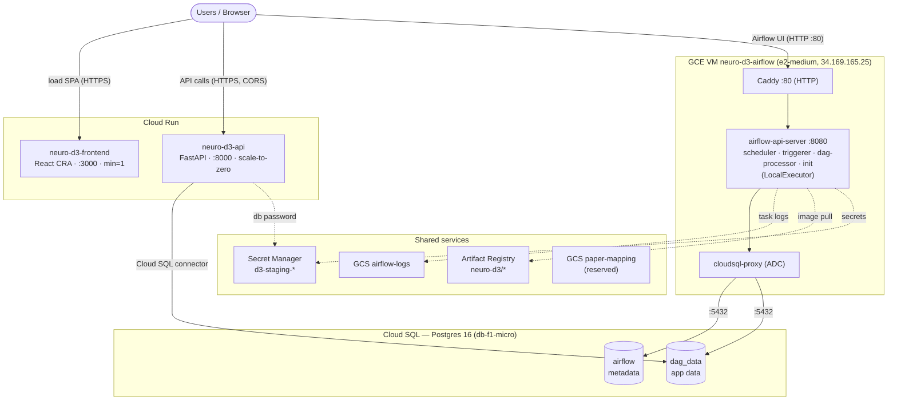

# NeuroD3 — Staging Architecture (GCP)

Current architecture of the **staging** environment in project `neuro-d3-staging`
(`us-west1`). See [README.md](README.md) for the resource list and [DEPLOY.md](DEPLOY.md)
for the apply runbook.

> **Boundary:** this module owns only in-project resources. The project, folder,
> billing, API enablement, and the Terraform state bucket are owned by the platform
> repo (`duralabs-infra`).

## Diagram

## Breakdown

**Project & boundary** — `neuro-d3-staging` (`us-west1`). Only in-project resources are
managed here; the project/folder/billing/API-enablement/TF-state bucket are platform-owned.

**Edge / networking** — `neuro-d3-vpc` + one subnet (`10.10.0.0/24`). Firewall: **80/443
open to the world** (Airflow via Caddy), **SSH 22 IAP-only** (`35.235.240.0/20`), **8080
never exposed**. **No NAT** — the VM egresses via its static public IP `34.169.165.25`
(image pulls, DANDI/OpenNeuro/OpenRouter APIs).

**Compute**
- **Cloud Run `neuro-d3-frontend`** — React CRA dev server, `min=1`, public. `REACT_APP_API_URL`
  points the browser-side app at the API.
- **Cloud Run `neuro-d3-api`** — FastAPI, scale-to-zero, public. Reads `dag_data` over the
  **Cloud SQL connector** (unix socket); `DB_PASSWORD` from Secret Manager; CORS allows the
  frontend origin.
- **GCE VM `neuro-d3-airflow`** (`e2-medium`) — runs the Airflow docker-compose stack:
  **Caddy** (plain HTTP on :80) → **api-server :8080**, **scheduler / triggerer / dag-processor**
  (LocalExecutor), one-shot **init**, and a **cloudsql-proxy** sidecar (ADC-authed). Image
  pulled from Artifact Registry; secrets fetched from Secret Manager into
  `/etc/neuro-d3/airflow.env`.

**Data** — **Cloud SQL Postgres 16 (`db-f1-micro`, public IP)**, user `airflow`, two DBs:
**`airflow`** (Airflow metadata: run history, task state, Variables/Connections) and
**`dag_data`** (app data: datasets, `*_paper_map`, `*_paper_citations`,
`*_paper_citation_classifications`, `papers`). VM connects via the Auth Proxy; Cloud Run via
the connector.

**Supporting**
- **Secret Manager** `d3-staging-{db-master-password, airflow-fernet-key, airflow-jwt-secret,
  airflow-api-secret-key, airflow-admin-password, openrouter-api-key}`
- **Artifact Registry** `us-west1-docker.pkg.dev/neuro-d3-staging/neuro-d3/{api,frontend,airflow}`
- **GCS** `…-airflow-logs` (Airflow task logs, native remote logging — **in use**) ·
  `…-paper-mapping` (**reserved**, unused — the GCS-cache TODO)
- **IAM** — 3 least-privilege SAs: *api* (sql.client + db-password secret), *frontend* (minimal),
  *airflow-VM* (sql.client, secretAccessor, AR reader, GCS objectAdmin)

**Persistence**

| State | Location | Durable? |
|---|---|---|
| Run history / task state | Cloud SQL `airflow` | ✅ |
| App data (datasets, paper maps, classifications) | Cloud SQL `dag_data` | ✅ |
| Task logs | GCS `…-airflow-logs` | ✅ |
| DAG code | git (re-cloned on VM boot) | ✅ |
| Secrets | Secret Manager | ✅ |
| Paper-mapping on-disk cache | local VM volume | ⚠️ ephemeral (→ GCS TODO) |

## Reachability

| Service | URL |
|---|---|
| Frontend | `https://neuro-d3-frontend-4crdc6p33a-uw.a.run.app` |
| API | `https://neuro-d3-api-4crdc6p33a-uw.a.run.app` |
| Airflow UI | `http://34.169.165.25` (HTTP-only; login `airflow` / `d3-staging-airflow-admin-password`) |

## Notes / open items (as of 2026-06-05)

- **Airflow UI is HTTP-only by design** — TLS was removed because login didn't work behind
  the self-signed cert; real HTTPS (DNS + Let's Encrypt) is deferred.
- The per-source dataset/paper-mapping tables and the API's source handling are **not yet
  centralized** — a single archive contract is planned (lets a new archive be added in one place).
- The **paper-mapping pipeline** (mapping + LLM classification) requires a real OpenRouter key
  and hasn't been run on staging yet; only ingestion has.
- Cloud SQL is `db-f1-micro` (max ~25 connections) — watch connection headroom as load grows.
