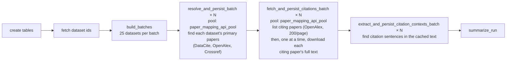
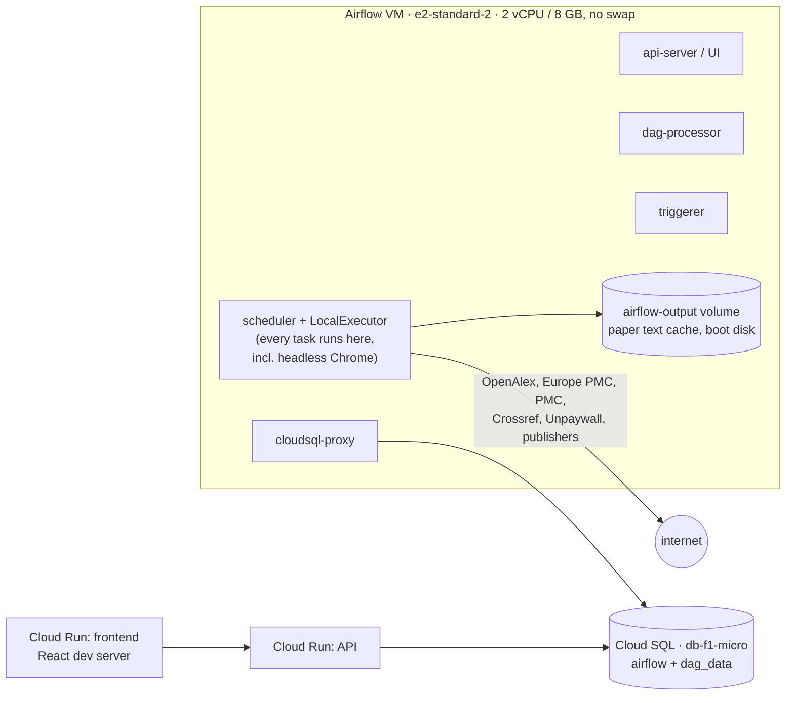

# Production to-do: paper-mapping throughput and infrastructure

Priority work before the pipeline goes to production. Goal: a full paper-mapping
backfill of one archive (primary papers, citing papers, full text, citation
contexts) in **2–3 hours**, without starving the Airflow UI or the API.

Numbers below were measured on staging on 2026-09-25, during the first run with
`max_citing_papers_per_primary = 2000` across all four archives. The DANDI,
OpenNeuro and SPARC runs were paused after their primary-paper phase. CRCNS was
stopped at 20:39 UTC after 4h16m, with about 7.5k citing papers stored, up from
726.

## Current architecture

### Paper-mapping DAG (one per archive: `dandi_`, `openneuro_`, `crcns_`, `sparc_paper_mapping`)

- Every stage is a mapped task over the same batches, and **each stage waits for
  every batch of the stage before it**. One slow citation batch holds back
  context extraction for the whole archive.
- Full text comes from `paper-text-fetcher`, which tries in turn: Europe PMC,
  NCBI PMC, Crossref, Unpaywall, publisher HTML, and headless Chrome (bioRxiv,
  PMC). The result, text or "no text", is written as a JSON file to the
  `airflow-output` Docker volume. `papers.fulltext_cache_key` points at that
  file.
- The citation limit (`max_citing_papers_per_primary`) is a run parameter only.
  It is not stored with the dataset (see item 8).

### Staging infrastructure

## What we measured

| | Staging, 2026-09-25 |
|---|---|
| Airflow VM | e2-standard-2 (2 vCPU, 8 GB, no swap), LocalExecutor, tasks run inside the scheduler container |
| Pool | `paper_mapping_api_pool`, 4–5 slots, shared by all four mapping DAGs |
| Database | Cloud SQL `db-f1-micro` (shared core, 0.6 GB), serving the API, Airflow metadata and the DAG writes. **Memory at 100% all day**, CPU about 18%. `dag_data` is only 39 MB |
| Primary-paper phase (resolve) | Fine: CRCNS 9 min, SPARC 11 min, OpenNeuro 21 min, DANDI 31 min |
| Citation phase, CRCNS | 1 of 6 batches finished in **2h21m** (27 primary papers, 1,015 citing papers). After 2h40m only 31 of 137 primary papers had been reached; projected at 6–9 more hours, then context extraction |
| Heaviest single primary | `cai-1` → 10.1038/nature12354: 1,999 citing papers, **2h49m** in one task |
| Throughput | ~50–60 citing papers/min across 5 tasks, about 7 s per citing paper per task |
| Per citing paper (one task) | First visit: median 4.0 s, average 7.9 s (p90 16.7 s, p99 33.5 s). Repeat visit (cache hit): median 0.26 s |
| By full-text outcome | Europe PMC / PMC hit ≈ 2.5 s; publisher HTML ≈ 8 s; bioRxiv via headless Chrome ≈ 9 s; **no text found ≈ 13.6 s** (2,135 of ~7,000 citing papers) |
| OpenAlex use | Citation listing is cheap: 101 requests for 1,015 citing papers (200 per page). The resolve phase used ~5.1k (OpenNeuro 2,970, DANDI 1,597, SPARC 370, CRCNS 178). The daily 10k budget hit 0 by 18:30 UTC; ~4–5k of it is not in task telemetry |
| VM load | CPU 76% average while mapping ran (peak 87%); load average 5–9 on 2 vCPU; memory 56% average (peak 64%); scheduler container 140–165% CPU, 3.6 GB; headless Chrome renderers at 20–27% CPU each |
| Side effects | Airflow UI slow; API `/api/paper-mapping/summary` 2.5 s, `/api/datasets` ~1 s |
| Local text cache | `airflow-output` volume on the VM boot disk: 860 MB of CRCNS mapping text + 498 MB paper-text-fetcher cache |

### Ops Agent / Cloud Monitoring, 2026-09-25 (UTC)

Charts are made from Cloud Monitoring data with
[`images/production-todo/render_metrics.py`](images/production-todo/render_metrics.py),
5-minute means. The early-morning spike is the VM restarting after the resize to
e2-standard-2.

- **VM:** CPU rose from about 20% to 75–87%, and load average stayed above 2
  (both cores busy) for the whole citation phase. It dropped straight back when
  CRCNS was stopped. Memory climbed steadily as the long-running tasks grew, to
  64%.
- **Cloud SQL:** memory is pinned at 100% even at idle, so every query competes
  for cache. This is the most likely cause of the slow API and UI, more than
  CPU.

### Where the time goes

- **Full text is fetched inline, one citing paper at a time.** Listing citing
  papers takes seconds. Each citing paper's full text is then downloaded
  serially inside the citation task, trying up to seven sources, including
  headless Chrome.
- **Failures are the slowest case.** A paper with no open text tries every
  source before giving up, averaging 13.6 s. The miss is recorded (a cache key
  is written either way), so later runs skip it, but it is never retried.
- **Duplicates are mostly caught.** 21% of visits were to a citing paper
  already seen by another dataset or primary (7,374 edges, 5,841 distinct
  citing papers). About 220 of those (~4% of task time) were real double
  downloads, where two tasks reached the same paper before either saved it. The
  worst case was the primary shared by `alm-1` and `ssc-1`: its two tasks ended
  up downloading the same 835 citing papers side by side.
- **Work is split by dataset count, not by work.** 25 datasets per batch, so
  one heavily cited primary (2,000 citing papers) pins one task for hours while
  the other slots finish.
- **Each stage waits for the whole previous stage,** so context extraction
  waits for the slowest citation batch.
- **Everything shares 2 vCPU,** so the scheduler, DAG processor, UI server and
  Chrome all compete.

## To do

### P0: before production

1. **Move full-text fetching out of the citation task.**
   - Citation tasks only list citing papers and store the edges: minutes per
     archive, about 1 OpenAlex request per 200 citing papers.
   - A separate text stage fetches full text for papers that don't have it yet.
   - The text stage works on distinct papers, deduplicated across archives,
     since `papers` is shared. A paper cited by two datasets is fetched once.
   - A task claims each DOI before fetching it, for example with a claim row or
     an advisory lock, so two concurrent tasks never download the same paper.

2. **Fetch full text concurrently, with a limit per source.**
   - Use a thread pool inside each text task (16–32 workers). The work is
     network-bound, so threads are enough.
   - Headless Chrome gets its own small pool (2–4 at once), because each
     renderer uses about a quarter of a core.
   - Give each source its own rate limit (Europe PMC, NCBI with an API key,
     Crossref polite pool, Unpaywall, bioRxiv, publisher sites) instead of one
     global 0.2 s interval.

3. **Split work by citing papers, not datasets.**
   - Build tasks from chunks of about 200 citing papers, so a 2,000-citer
     primary becomes 10 parallel tasks rather than one 3-hour task.

4. **Retry failed full-text lookups on a schedule.**
   - Misses are already cached, but permanently, so a paper that becomes open
     access later is never picked up. They were about 30% of citing papers
     today.
   - Store a retry-after date (for example 30 days) with the reason, and
     re-try only those that are due, in the background at low priority.
   - Stop the hardest sources early: skip the headless-Chrome path for DOIs
     whose publisher has never yielded text.

5. **Store paper full text in a persistent shared store (GCS bucket).**
   - **Today it isn't persisted anywhere safe.** Text lives in the
     `airflow-output` Docker volume on the VM boot disk (`/opt/airflow/output`,
     about 1.4 GB after one partial run). `docker-compose.gce.yml` already marks
     it "ephemeral; TODO move to GCS".
   - It survives restarts, but a VM rebuild loses it, and
     `papers.fulltext_cache_key` would then point at files that no longer exist.
   - Put the text in a bucket, keyed by normalised DOI, read and written by
     both mapping and classification.
   - That also lets a separate backfill VM (item 10) and the regular VM share
     one cache.
   - Add a lifecycle policy, and a one-time upload of the existing cache.

6. **Extract citation contexts per chunk, not after the whole run.**
   - Run context extraction right after a chunk's text is available (or in the
     same task), so contexts don't wait for the slowest batch of the DAG run.

7. **Account for the whole OpenAlex budget.**
   - Find the ~4–5k requests that aren't in task telemetry today (likely
     paper-text-fetcher's own lookups or other runs that day), and count them.
   - Make the resolve phase incremental: skip datasets whose metadata hasn't
     changed since they were last resolved.
   - Check the budget per task, not only at the start of the run.
   - Decide whether production needs a paid OpenAlex tier.

8. **Record how deep each dataset's citations were checked.**
   - Today nothing says whether a primary paper's citing papers were checked up
     to 10, 2,000 or not at all. `max_citing_papers_per_primary` is a run
     parameter and isn't stored.
   - Add fields per (dataset, primary paper) on `<archive>_paper_map`:
     - `citations_checked_at`
     - `citations_cap`: the limit used
     - `citations_available`: OpenAlex's total after the dataset's creation
       date, from `meta.count` on the first page, so no extra request
     - `citations_listed`: how many were stored
   - Then `citations_listed < citations_available` flags truncated papers, a
     later run can resume only those, and the dashboard can show "2,000 of
     8,412 citing papers checked".
   - Also store the run's parameters in `<archive>_paper_resolution_runs`.

### P1: infrastructure

9. **Upgrade Cloud SQL.**
   - Memory is at 100% on `db-f1-micro` (0.6 GB) even at idle. Move to at
     least `db-g1-small` (1.7 GB), or `db-custom-1-3840` (1 vCPU, 3.75 GB) for
     production.
   - The data is small (39 MB); the problem is memory and CPU, not storage.
   - Consider separating Airflow's metadata database from `dag_data`.
   - The change restarts the database for a minute or two.

10. **A separate large VM for the backfill, on a schedule (for example weekends).**
    - A `backfill` Airflow queue served by a worker on a large VM (for example a
      16-vCPU high-CPU machine, spot if acceptable).
    - A GCE instance schedule starts it on Saturday and stops it when the queue
      is empty or on Sunday night.
    - The regular VM keeps the UI, the scheduler and daily incremental runs.
    - Target: at about 7 s per citing paper, 20k citing papers is about 40
      worker-hours. With 20–30 concurrent fetchers that's about 1.5–2 hours.
      Later runs are much shorter, since cached papers take about 0.3 s.
    - Needs items 5 (shared text store) and 11 (a worker outside the scheduler).

11. **Separate task execution from the scheduler.**
    - Move from LocalExecutor, where tasks run inside the scheduler container,
      to CeleryExecutor or a dedicated worker container with CPU and memory
      limits. Heavy tasks then can't slow the UI or the scheduler.

12. **Pools per resource instead of one mapping pool.**
    - `openalex_pool`, `fulltext_pool`, `chrome_pool` (and the existing
      classification pool), each sized to that resource's limit.
    - Set their sizes in config so they survive a VM reboot.
      `PAPER_MAPPING_API_POOL_SLOTS` currently resets to 2 at start-up.

13. **Memory safety on the Airflow VM.**
    - Add a 2–4 GB swap file (startup script).
    - Set container memory limits.
    - Alert when memory is above 85%.

14. **Upgrade Airflow 3.1.5 → 3.3.x.**
    - 3.3.2 is current (2026-09-17). 3.2.0 added UI performance work and ~42×
      faster rendered-field cleanup for DAGs with many mapped tasks, which
      matches ours. 3.2.0 also moved to SQLAlchemy 2.0, so check custom SQL
      and plugins.
    - None of the 3.2–3.3 notes mention scheduler or pool changes, so this
      doesn't replace items 1–3, 11 and 12.
    - Soak it on staging with `stack_integration_test` before production.

### P2: user-facing and visibility

15. **Frontend production build.** Staging serves the React development server
    (a 3 MB unminified `bundle.js`).
16. **API latency.**
    - `/api/paper-mapping/summary` takes 2.5 s: cache it or use a materialised
      view. Recheck after item 9.
    - Consider `min_instance_count = 1` on the API to avoid cold starts.
17. **Progress and metrics for long tasks.**
    - Progress logging is done (`utils/batch_progress.py`).
    - Still to do: time per source for full-text fetches, and a dashboard for
      citing papers per minute, the OpenAlex budget and the text hit rate.

## Projected cost

Approximate on-demand list prices for us-west1 as of 2026-09. Confirm in the
[GCP pricing calculator](https://cloud.google.com/products/calculator) before
committing; spot prices vary.

| Component | Staging today | Production proposal | Monthly (≈) |
|---|---|---|---|
| Airflow VM (UI, scheduler, daily runs) | e2-standard-2, ~$49/mo | e2-standard-2, with tasks moved to a worker (item 11). e2-standard-4 if they stay local | $49–98 |
| Backfill VM, weekends only | — | e2-highcpu-16, ~10 h per weekend: ~$0.40/h on-demand, ~$0.12/h spot | $5–17 |
| Cloud SQL | db-f1-micro, ~$8/mo + storage | db-g1-small (~$26) or db-custom-1-3840 (~$50) | $26–50 |
| Paper text store | boot disk (free, not durable) | GCS Standard, 10–50 GB at ~$0.02/GB | < $1 |
| Boot disk, Cloud Run, Artifact Registry | ~$5–10/mo | same | $5–10 |
| OpenAlex | free key, 10k requests/day | free, or a paid tier if item 7 shows it's needed | TBD |
| **Total** | **~$65–70/mo** | lean: **~$85/mo**; comfortable: **~$175/mo** | |
